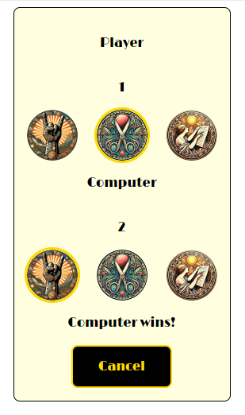
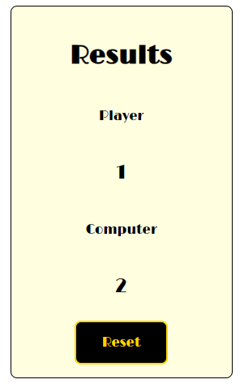

# Kámen, nůžky, papír

Cílem tohoto zadání je vytvoření jednoduché hry zvané "Kámen, nůžky, papír". Během toho by měli studenti předvést, že rozumí:
* předávání hodnot mezi komponentami
* obsluze událostí
* uchování stavu komponent
* použití hooku useState
* použití hooku useEffect

## Zadání
Bezprostředním cílem je dokončení aplikace do použitelného stavu. K dispozici máte základní strukturu komponent, css moduly k nim patřící a připojené assety.

Z dokumentace máte povolenou oficiální dokumentaci a své vlastní poznámky v sešitu nebo OneNote.

### Popis komponent

#### App
Kořenová komponenta obsahuje mechanismy pro přepínání mezi oběma obrazovkami. To znamená nadefinovaný typ a state.
Dále je nejvyšší komponentou pracující s informacemi o skóre uživatele a počítače.
Použijte zde useEffect tak, aby při změně skóre (kterékoli z nich dosáhne 3) došlo k automatickému přepnutí na ResultScreen. Tento výsledek chceme také zobrazovat, musí být tedy správně uložen.

#### ResultScreen
Slouží jen pro zobrazení výsledku hry. Musí tedy dostávat obě skóre a musí umět přepnout obrazovku tlačítkem "Cancel".

#### PlayScreen
Je nejzajímavější komponenta. Musí obsahovat prostředky pro zobrazení voleb hráče a počítače včetně definice vhodných datových typů.
Dále musí obsahovat prostředky (funkci) pro vyhodnocení vítěze daného kola, to zahrnuje datový typ pro vrácení výsledku.

V této komponentě použijte useEffect k tomu, abyste reagovali na změnu volby uživatele tím, že vygenerujete náhodnou volbu počítače a obě volby vyhodnotíte.

#### Choices
Je jednoduchá komponenta sloužící jako obal pro volby hráče a počítače. Dostává informaci o tom jaký symbol má být vybraný a akci, která slouží pro obsluhu kliknutí na daný symbol v případě hráče. V případě počítače tato vlastnost nebude vůbec použita a tato props je volitelná (např. chooseAction?: (...) => void;). Jinak vykresluje jen tři komponenty Figure, kterým předává vhodná data. V této komponentě jsou odstraněné jen závislosti na datových typech z nadřízených komponent.

#### Figure
Obsahuje jeden symbol (kámen, nůžky, papír). Tuto komponentu máte k dispozici celou. Tato komponenta slouží zároveň jako nápověda datových typů z nadřazených komponent. Máte ji k dispozici, protože zpracování toho, že je akce pro kliknutí volitelná, je docela složité a zabere neadekvátně mnoho času.

### Další úkoly
* Při vytváření funkce reagující na volbu hráče a generující náhodný tah počítače lze zvolit dva způsoby, oba vyzkoušejte a do README souboru repozitáře napište, který je lepší a proč:
  * umístit kód přémo do funkce obsluhující nastavení uživatelova tahu
  * umístit kód do vhodného useEffectu
* Pokud vás k předchozímu bodu nic nenapadá, zkuste volit stále stejný symbol. Napište proč se aplikace chová tak, jak se chová. Horší způsob ponechte v kódu zakomentovaný.
* vyřešte stav zobrazení hry, kdy je hra po spuštění a hráč zatím nic nevybral

## Screenshoty

Během hry

vyhodnocení

